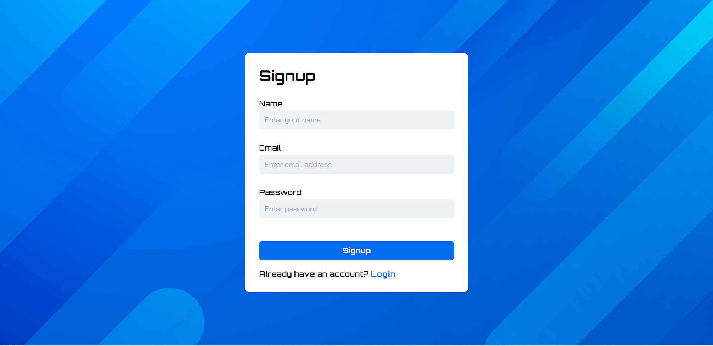
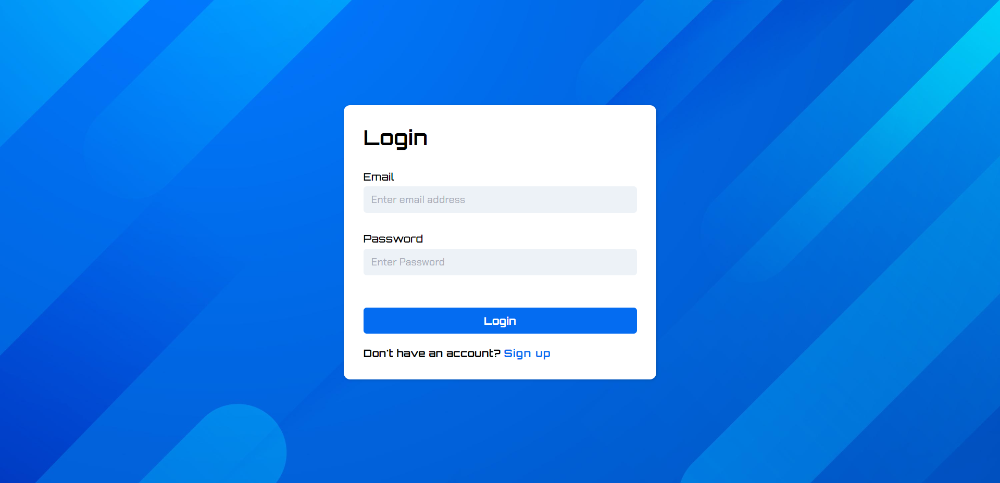
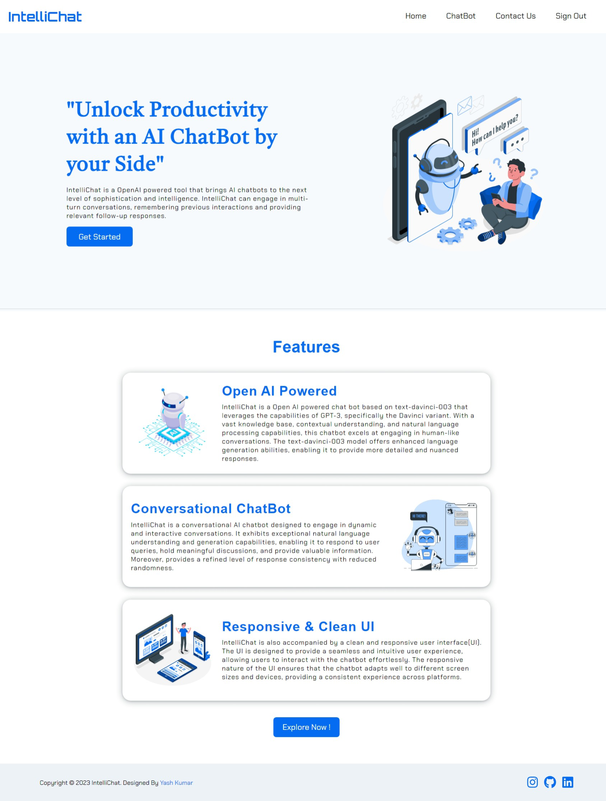
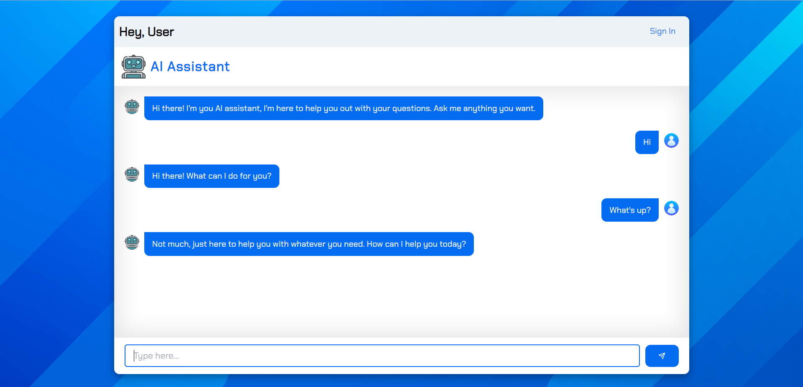

#  - AI Powered Job Coaching Assitant

`SupportEdge` is an Azure AI powered tool that brings chatbots to the next level of sophistication and intelligence. `SupportEdge` can engage in multi-turn conversations, remembering previous interactions and providing relevant follow-up responses.

<!-- ## 📸Preview

### SignUp Page


### LogIn Page


### Home Page


### ChatBot UI
 -->


## ✨Features

- `Real-time chat interface`: Users can type their queries and receive instant responses from the chatbot.
- `Azure AI-powered responses`: The chatbot uses the Azure AI API to generate intelligent and contextually relevant responses.
- `Conversational AI`: The chatbot supports natural and interactive conversations.
- `Responsive and clean UI`: The chatbot's ui is designed to adapt to different screen sizes and provides a visually appealing and clutter-free experience.
- `Authentication`: Users can sign up and log in to have personalized conversations with the chatbot.
- `User Feedback/Queries`: Users can send their feedback, questions, or queries through a `contact form`, enabling direct communication with the administrators.
- `Firebase integration`: Firebase is used for authentication, allowing users to sign up and log in securely. It also provides a real-time database for storing user information and contact form submissions.

## 🤖Technologies Used

`SupportEdge` is built using the following technologies:

- `React.js`: A JavaScript library for building user interfaces.
- `CSS Modules`: A CSS file format that allows for local scoping of CSS styles in React components.
- `AzureAI API`: The Azure AI API is used for natural language processing and generating AI-powered responses.
- `Node.js`: A JavaScript runtime environment that allows running JavaScript on the server-side.
- `Express`: A web application framework for Node.js used to handle backend API routes and requests.
- `React Router`: A library for handling routing in a React application.
- `Axios`: A promise-based HTTP client for making API requests from the frontend.
- `Firebase`: A comprehensive development platform that provides authentication, hosting, and database services.
- `dotenv`: A zero-dependency module for loading environment variables from a .env file.
- `CORS`: Cross-Origin Resource Sharing, a mechanism for handling cross-origin requests in web browsers.
- `Nodemon`: A development tool that automatically restarts the server when changes are made to the code.

## ✨Prerequisites

Before getting started, make sure you have the following prerequisites installed:

- `Node.js`: Install Node.js from the official [website](https://nodejs.org).
- `AzureAI API key`: Sign up for the AzureAI API and obtain an [API key](https://azure.microsoft.com/en-us/products/ai-services).
- `Firebase account`: Create a Firebase account and set up a new project.

## 💻Getting Started

To run the `SupportEdge` locally, follow these steps:

1. Clone the repository: `https://github.com/Habeeboss/JobCoach.git`
2. Navigate to the project directory: `cd JobCoach`
3. Install the dependencies: `npm install`
4. Create a `.env` file in the backend folder and add your Azure AI API key:
   ```bash
   Azure AI_KEY=YOUR_API_KEY
   ```
5. Start the frontend server:
   ```bash
   cd frontend
   npm start
   ```
6. Start the frontend server:
   ```bash
   cd backend
   npm start
   ```
7. Open your web browser and visit [localhost:3000](http://localhost:3000) to access the frontend and [localhost:5500](http://localhost:5500) to access the backend.

## 📑Resources

- [AzureAI API documentation](https://learn.microsoft.com/en-us/azure/ai-services/reference/rest-api-resources)
- [Firebase documentation](https://firebase.google.com/docs)

## ✨Credits

`SupportEdge` is developed and maintained by `Bharath and Habeeb` as part of Microsoft Global Innovation Challenge. Acknowledgements and credits to Azure AI API Developers and Devesh and Kanika for the work.

## 📧Contacts

For any inquiries or feedback, please contact [Here](mailto:bharathkumarsampath.me@gmail.com).
